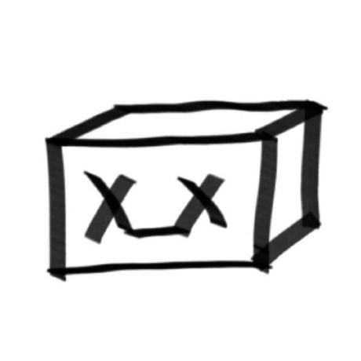

# joycon SmolVLA

#### ***Written by BOX2AI SML 2025.7.28***   
     


##
### 1.找到机械臂端口：在终端运行命令行然后【拔掉typeC数据线】，然后按【Enter回车】（一般为/dev/ttyACM*）得到端口号，要执行【两次】分别找到主机械臂和从机械臂的端口号
```shell
python -m lerobot.find_port
```
##

### 2.校准机械臂：分别校准主从机械臂，命令行指定【机械臂类型】、【机械臂端口号】、【自定义机械臂id】（体现在校准文件id.json）,您可以在你的主文件夹下按【ctrl+h】打开隐藏文件，在【.cache/huggingface/lerobot/calibration】找到你的校准文件
***端口授权***
```shell
sudo chmod 777 /dev/ttyACM0
sudo chmod 777 /dev/ttyACM1
```
### 校准方法
***终端执行命令行后，您需要将机器人移动到所有关节位于其范围中间的位置【中位】。【Enter回车】后,移动每个关节通过其全范围的运动得到其所有关节可达范围***

***中位***


***校准从臂***
```shell
python -m lerobot.calibrate --robot.type=so100_follower --robot.port=/dev/ttyACM0 --robot.id=follower
```

### 3.teleop_joycon遥操作：遥控机械臂
```shell
python -m lerobot.teleoperate --robot.type=so100_follower --robot.port=/dev/ttyACM0 --robot.id=follower --teleop.type=joycon 
```

***查找相机：您可以在【~/workspace/smolvla/lerobot/outputs/captured_images】找到你的相机所对应的序号***
```shell
python -m lerobot.find_cameras opencv
```
***带图像的遥操作***
```shell
python -m lerobot.teleoperate --robot.type=so100_follower --robot.port=/dev/ttyACM0 --robot.id=follower --robot.cameras="{ OBS_IMAGE_1: {type: opencv, index_or_path: 2, width: 640, height: 480, fps: 60}}" --teleop.type=joycon --display_data=true
```

##
### 4.record录制数据集：若要重新录制可以删掉原数据集【~/.cache/huggingface/lerobot/Datasets】
```shell
python -m lerobot.record --robot.type=so100_follower --robot.port=/dev/ttyACM0 --robot.id=follower --robot.cameras="{ OBS_IMAGE_1: {type: opencv, index_or_path: 2, width: 640, height: 480, fps: 60}}" --dataset.single_task="Grasp an orange block and put it in the box."  --dataset.repo_id=Datasets/grasp_put --dataset.episode_time_s=30 --dataset.reset_time_s=10  --dataset.num_episodes=50 --teleop.type=joycon
 ```
 
 ##
 ***加载HF官网镜像，为了更快地正确部署huggingface官网的smolvla_base模型***
 ```shell
export HF_ENDPOINT=https://hf-mirror.com
```
##
### 5.train训练：在smolvla_base的基础上微调你的任务，训练参数可以修改（如果GPU显存限制，可以尝试减小batch_size；迭代epoch的步数steps也会影响模型性能）
 ```shell
python lerobot/scripts/train.py   --policy.path=lerobot/smolvla_base   --dataset.repo_id=Datasets/grasp_put   --batch_size=8   --steps=20000   --output_dir=outputs/train/smolvla   --job_name=smolvla_training   --policy.device=cuda
```
***同时您也可以采集多个数据集协同训练，修改语言标签采集数据，最后一个模型根据不同的语言输入区分不同的任务：这才是真正体现它在作为VLA模型的优势所在（但是需要较多的数据集和较长时间的训练才能达到一个比较好的效果）***
 ```shell
python lerobot/scripts/train.py   --policy.path=lerobot/smolvla_base   --dataset.repo_id={Datasets/grasp_put1,Datasets/grasp_put2}   --batch_size=8   --steps=20000   --output_dir=outputs/train/smolvla   --job_name=smolvla_training   --policy.device=cuda
```
##
### 6.reference推理：检验您的模型的微调效果
```shell
python -m lerobot.record --robot.type=so100_follower --robot.port=/dev/ttyACM0 --robot.id=follower --robot.cameras="{ OBS_IMAGE_1: {type: opencv, index_or_path: 4, width: 640, height: 480, fps: 60}}" --dataset.single_task="Grasp an orange block and put it in the box."  --dataset.repo_id=Datasets/eval_grasp_put_orange  --dataset.episode_time_s=300 --dataset.reset_time_s=10  --dataset.num_episodes=50  --policy.path=/home/sml/workspace/SMOLVLA/lerobot/outputs/train/20kob_smolvla/checkpoints/last/pretrained_model 
```