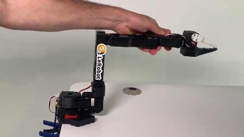

# Leorbot-joycon2 for SmolVLA

### 0.安装
```shell
# install lerobot
conda create -y -n lerobot python=3.10
conda activate lerobot

conda install -y ffmpeg -c conda-forge
conda install -y ffmpeg=7.1.1 -c conda-forge

# cd lerobot
pip install -e .
pip install lerobot
pip install 'lerobot[feetech]'      # Feetech motor support
# pip install transformers
# pip install num2words -i https://mirrors.tuna.tsinghua.edu.cn/pypi/web/simple some-package
pip install -e ".[smolvla]" -i https://mirrors.tuna.tsinghua.edu.cn/pypi/web/simple some-package

# install joycon robotics
# git clone https://github.com/box2ai-robotics/joycon-robotics.git
cd joycon-robotics
pip install -e .
sudo apt-get update
sudo apt-get install -y dkms libevdev-dev libudev-dev cmake
make install
cd ..

# install lerobot-kinematics
# git clone https://github.com/box2ai-robotics/lerobot-kinematics.git
cd lerobot-kinematics
pip install -e .
cd ..

pip uninstall -y numpy pynput datasets 
pip install numpy==1.24.4 pynput==1.7.7 datasets==3.4.1 
```

##
### 1.校准机械臂
插入您的机械臂的电源和TypeC-USB，运行下面的指令
```shell
# python -m lerobot.find_port # 默认是ACM0

sudo chmod 777 /dev/ttyACM0

python -m lerobot.calibrate --robot.type=so101_follower --robot.port=/dev/ttyACM0 --robot.id=follower
```
然后按照下面的操作执行：

1) 将机械臂扳动到0位后，按下回车：



2) 移动每个关节通过其全范围的运动得到其所有关节可达范围

3) 观察最大最小值是否正常，然后按下回车即校准完毕，程序会自动保存校准文件到 `~/.cache/huggingface/lerobot/calibration/robots/so101_follower/follower.json` 中.(下按【ctrl+h】打开隐藏文件)

### 3.teleop_joycon遥操作：遥控机械臂
```shell
python -m lerobot.teleoperate --robot.type=so101_follower --robot.port=/dev/ttyACM0 --robot.id=follower --teleop.type=joycon 
```

***查找相机：您可以在【~/workspace/smolvla/lerobot/outputs/captured_images】找到你的相机所对应的序号***
```shell
python -m lerobot.find_cameras opencv
```
***带图像的遥操作***
```shell
python -m lerobot.teleoperate --robot.type=so101_follower --robot.port=/dev/ttyACM0 --robot.id=follower --robot.cameras="{ OBS_IMAGE_1: {type: opencv, index_or_path: 2, width: 640, height: 480, fps: 60}}" --teleop.type=joycon --display_data=true
```

##
### 4.record录制数据集：若要重新录制可以删掉原数据集【~/.cache/huggingface/lerobot/Datasets】
```shell
python -m lerobot.record --robot.type=so101_follower --robot.port=/dev/ttyACM0 --robot.id=follower --robot.cameras="{ OBS_IMAGE_1: {type: opencv, index_or_path: 2, width: 640, height: 480, fps: 60}}" --dataset.single_task="Grasp an orange block and put it in the box."  --dataset.repo_id=Datasets/grasp_put --dataset.episode_time_s=30 --dataset.reset_time_s=10  --dataset.num_episodes=50 --teleop.type=joycon
 ```
 
 ##
 ***加载HF官网镜像，为了更快地正确部署huggingface官网的smolvla_base模型***
 ```shell
export HF_ENDPOINT=https://hf-mirror.com
```
##
### 5.train训练：在smolvla_base的基础上微调你的任务，训练参数可以修改（如果GPU显存限制，可以尝试减小batch_size；迭代epoch的步数steps也会影响模型性能）
 ```shell
python lerobot/scripts/train.py   --policy.path=lerobot/smolvla_base   --dataset.repo_id=Datasets/grasp_put   --batch_size=8   --steps=20000   --output_dir=outputs/train/smolvla   --job_name=smolvla_training   --policy.device=cuda
```
***同时您也可以采集多个数据集协同训练，修改语言标签采集数据，最后一个模型根据不同的语言输入区分不同的任务：这才是真正体现它在作为VLA模型的优势所在（但是需要较多的数据集和较长时间的训练才能达到一个比较好的效果）***
 ```shell
python lerobot/scripts/train.py   --policy.path=lerobot/smolvla_base   --dataset.repo_id={Datasets/grasp_put1,Datasets/grasp_put2}   --batch_size=8   --steps=20000   --output_dir=outputs/train/smolvla   --job_name=smolvla_training   --policy.device=cuda
```
##
### 6.reference推理：检验您的模型的微调效果
```shell
python -m lerobot.record --robot.type=so101_follower --robot.port=/dev/ttyACM0 --robot.id=follower --robot.cameras="{ OBS_IMAGE_1: {type: opencv, index_or_path: 4, width: 640, height: 480, fps: 60}}" --dataset.single_task="Grasp an orange block and put it in the box."  --dataset.repo_id=Datasets/eval_grasp_put_orange  --dataset.episode_time_s=300 --dataset.reset_time_s=10  --dataset.num_episodes=50  --policy.path=/home/sml/workspace/SMOLVLA/lerobot/outputs/train/20kob_smolvla/checkpoints/last/pretrained_model 
```


*Written by BOX2AI SML 2025.7.28* 